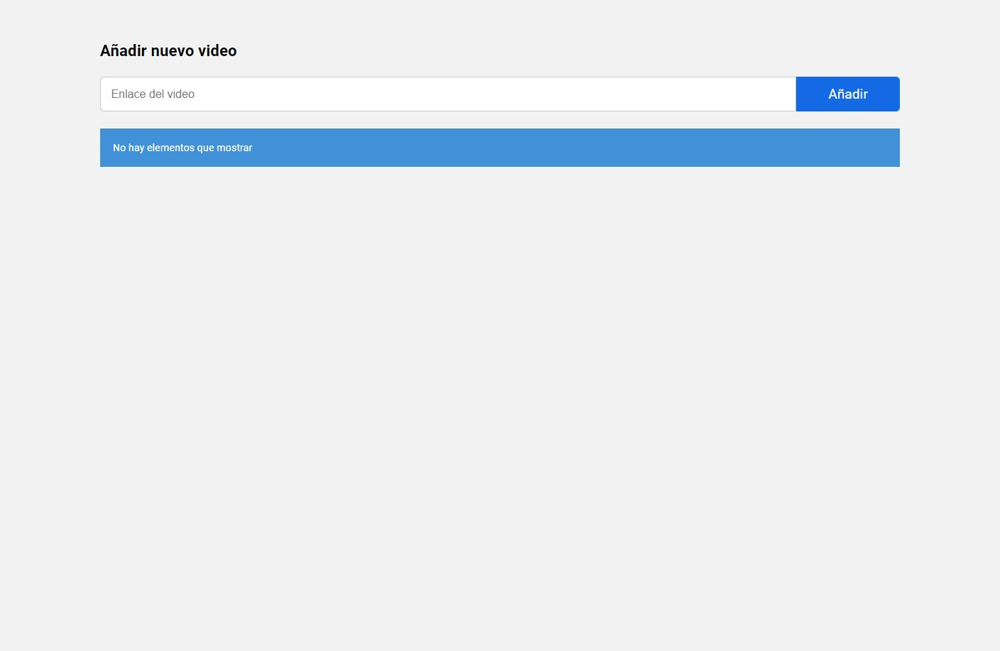
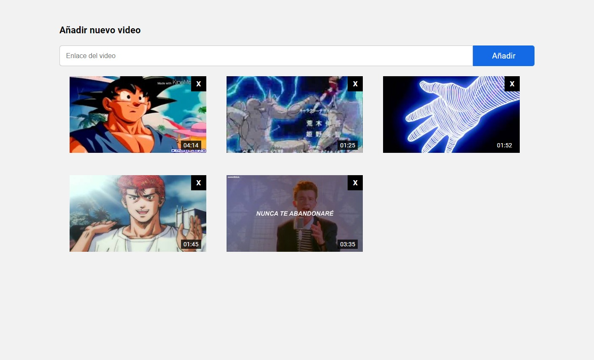
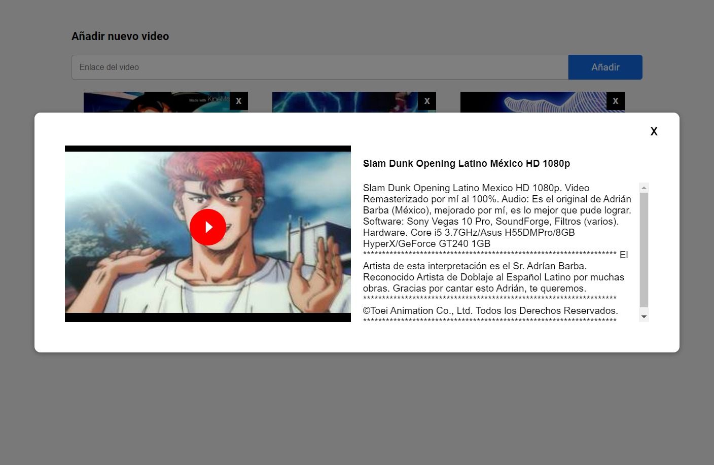
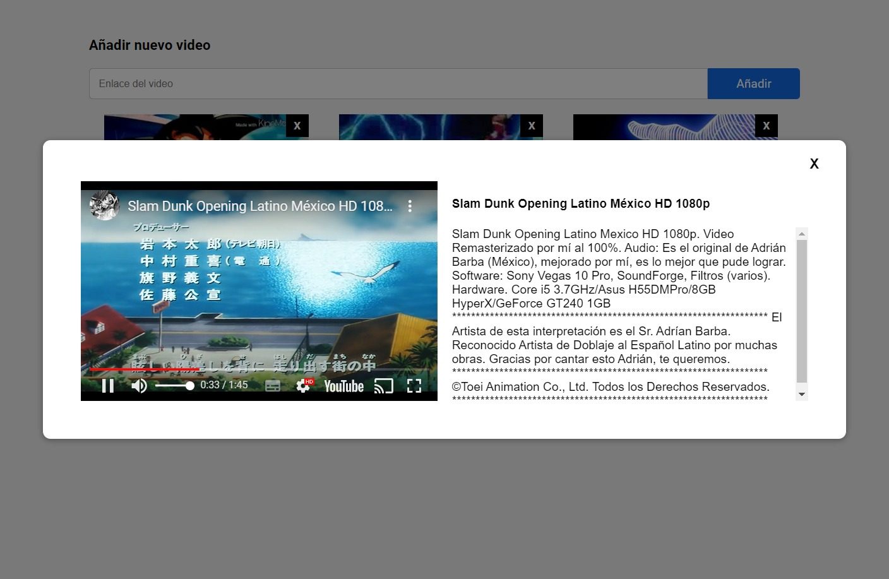
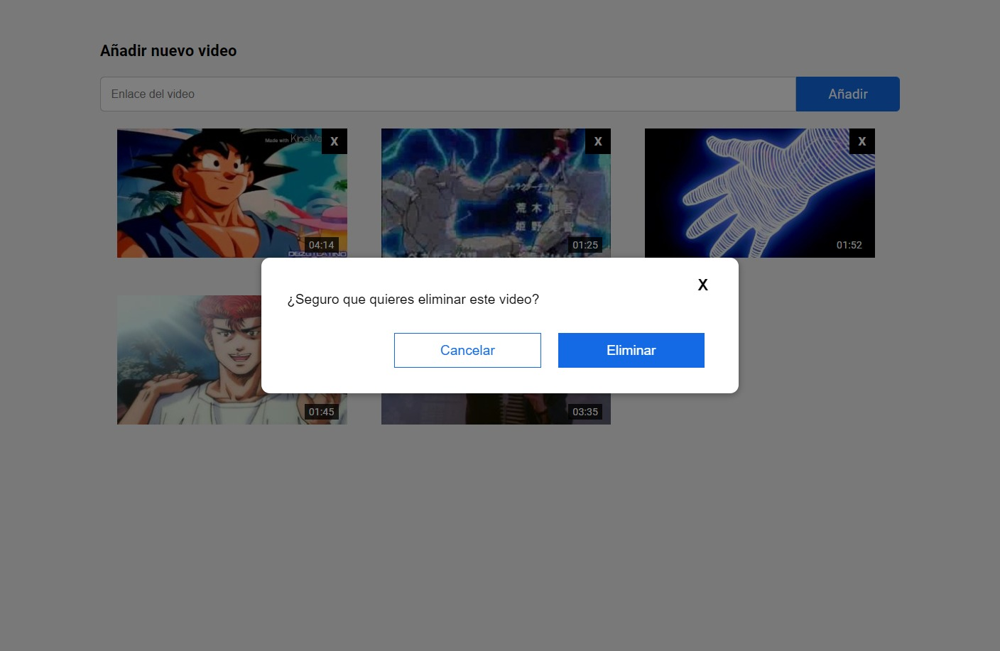

# afex_prueba

- WEBAPP Utilizando Vue3 y Firebase
- Desarrollo por Johan Roure para prueba tecnica AFEX

Demo: https://buoyant-habitat-368816.web.app/

## Descripcion

El web app hecho en vue con composite API tiene como objetivo permitir agregar, visualizar y eliminar videos de una galeria de videos de youtube, se almacena la info en firebase.

## Requisitos

- Vue3
- Vite
- eslint

## Setup del proyecto

```sh
npm install
```

### Ejecución en local (desarrollo en puerto 3000)

```sh
npm run serve
```

### Compilar y preparar para producción

```sh
npm run build
```

### Lint con [ESLint](https://eslint.org/)

```sh
npm run lint
```

## Modo de uso

- Para agregar un nuevo video se debe ingresar la dirección del video en Youtube; en formato www.youtube.com o youtu.be y hacer click en Añadir. Si hay errores se mostraran al usuario.

- Al hacer click cualquier miniatura de video se abrira un modal donde se podra ver informacion del video y reproducirlo al presionar el boton play

- Al hacer click al boton eliminar de las miniaturas se abrira un modal de confirmacion antes de efectuar el borrado.

## Capturas

- Listado sin elementos


- Listado con elementos


- Estado inicial del MODAL


- Estado del MODAL cuando se presiona PLAY


- Confirmacion antes de eliminar
